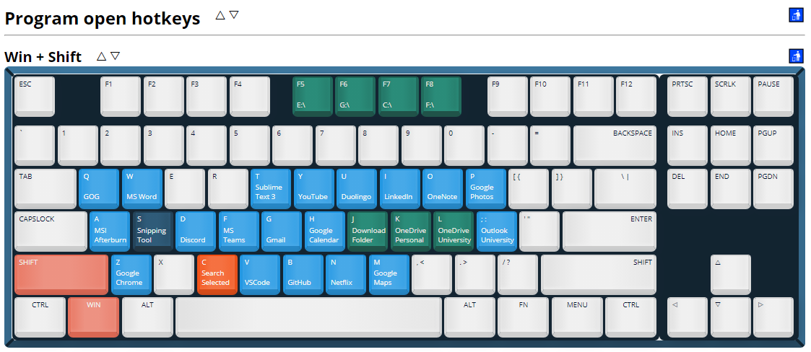

# Keyboard Shortcut Map Maker

This is a website tool for creating a visual map/image of keyboard shortcuts or keybindings.  

It originally started as a tool to generate help pages for my [ahk-scripts](https://github.com/Archie-Adams/ahk-scripts) project.  

Note: A single file version of this website for easier local use can be found in the [releases](https://github.com/Archie-Adams/keyboard-shortcut-map-maker/releases) page.  

---

### Features:
- Saving and loading using html files.
- Saving to a png file.
- Styling for printing.
- Adding infinite keyboards.
- Adding infinite sections.
- Renaming keyboards and sections.
- Re-ordering the list of keyboards and sections.
- Multiple colour options.

### Planned Features:
- Adding key chord tables/sections.
- Collapsable notes section for each keyboard.
- Custom colours.
- Full control over key text.
- Different keyboard layouts.
- One HTML file version of the site.
- Better styling + more key animations.
- Code refactor and clean-up.
- Collapsable sections.
- Keyboard control.

### Known Issues:
- Cannot reload same file without loading another in-between.
  - Caused by load function being called on input file change.

&nbsp;

# [Live Site ↪](https://archie-adams.github.io/keyboard-shortcut-map-maker/)

# Images

  

# Dependencies

[dom-to-image](https://github.com/tsayen/dom-to-image)  
[file-saver](https://github.com/eligrey/FileSaver.js/)  

# Contributing

If you would like to improve upon this project and feel welcome to submit a pull request.  

# Acknowledgments
[Keyboard](https://github.com/guido732/mechanical-keyboard) inspiration: [Guido Torres](https://github.com/guido732)  
